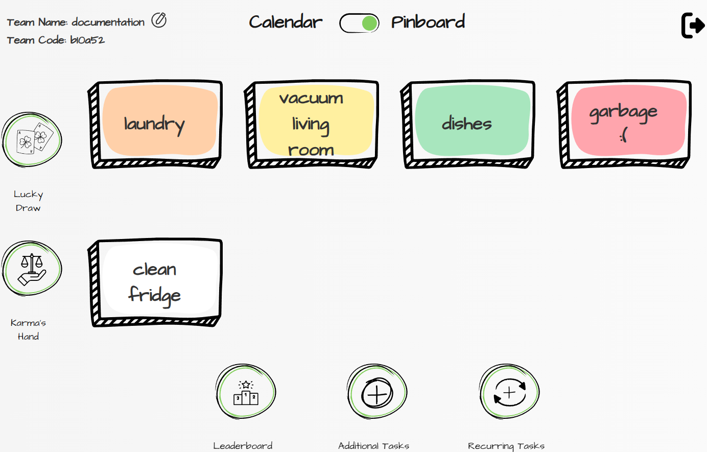
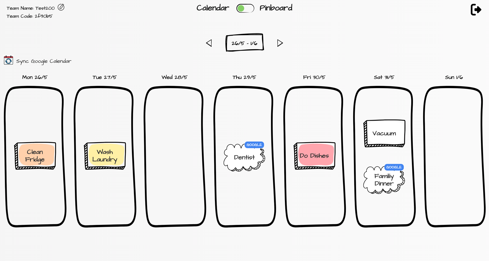

# TASK AWAY (Sopra Group 07)

## Introduction

TASK AWAY is a chore management app designed for shared living spaces. It helps teams assign, track, and complete household tasks through a shared interactive pinboard. The task assignment system is flexible, supporting various distribution methods: First-Come-First-Serve (default), Karma’s Hand (based on progress), and Lucky Draw (randomized allocation). To boost motivation, the app incorporates gamification — users earn XP and level up by completing tasks. Calendar integration (via Google Calendar API) keeps everyone on track, while promoting teamwork and transparency.

## Technologies
The technologies we used for this project were

    Node.js
    React
    Javascript
    Websockets
    NPM Package Manager

## High-level components

### Pinboard

The [pinboard page](/app/pinboard/[id]/page.tsx) holds the logic for all pop ups that can be accessed from there (leaderboard, task inspection, additional task creation and recurring task overview/configuration). Not only does it manage what content is visible in the pop up based on where it is opened from but also prevents a user from actions that are not possible e.g. due to another user currently editing an element. This and keeping the state of the task list always up to date.

#### Task List

The [task list](/app/pinboard/[id]/taskList.tsx) is part of the pinboard page. It is responsible to display the currently active tasks in the color of the assigned user and/or based on the current game mode.

#### Recurring Task Overview/Configuration

The [recurring task overview](/app/pinboard/[id]/recurringTaskOverview.tsx) is the content of the most complex pop up that is accessible via the pinboard. It holds the logic to not only display all existing recurring tasks but also add as many new ones, delete some and or modify multiple ones in a single session and in the end simply safe all of these adaptations by the click of a single button.

### Calendar

The [calendar](/app/calendar/[id]/calendar.tsx) on the [calendar page](/app/calendar/[id]/page.tsx) holds a navigatable calendar that starts in the current week and displays the TaskAway tasks as well as the google events of the user in case a google calendar was synchronised.

### Form Component & Task Card

The [form component](/app/components/form/form.tsx) with all its partial components streamlines the handling of all forms throughout the application. It can be configured based on what fields should be displayed within the form, their styling and validation as well as the buttons that should be associated with the form. It also allows to switch between a view and an edit mode of the data within the form. The most used component leveraging this form component is the [task card component](/app/components/taskCard.tsx) which is used to display the Task Away tasks throughout the application in pop ups but also e.g. in the recurring task overview.

## Launch & Deployment

Todo....

## Illustrations

There are 3 levels of permission. 
As a visitor you only have access to the welcome page which then allows you to either login or register. 
As a logged in user that is not part of a team yet access is granted to the choose team page. On there one can either create a new team, join an existing one or delete their account completely. 
Once you are part of a team you will see your teams pinboard after log in and have the option to navigate between this pinboard and a calendar view.

The pinboard is the main hub. Here you can see all currently active tasks and can inspect them for further information. You can add additional tasks (which are only supposed to be done once) and manage recurring tasks (which will apear on the pinboard in a regular cycle).
From here you can also access the leaderboard which displays all team members ranked based on their XP and lets you inpect others and your own profile. In your own profile you also have the option to leave the team if you no longer want to be part of it.
To the left you have the option to mix up the way of distributing tasks. Either use Karmas Hand if you want to distribute them fairly (based on already achieved XP of users) or take a risk with Lucky Draw - you do not know what you get but then have to do it if you do not wanna loose XP.

The calendar view allows you to coordinate the Task Away tasks with the events from your google calendar. Once you synced it not only will your google events be shown next to the Task Away tasks in the applications calendar but you will also see the Task Away tasks in your google calendar.

## Roadmap

Further version of TASK AWAY could include these functionalities:

* New game modes to enhance task assignment variety 
* Global leaderboard showcasing all teams ranked by total team XP  
* Task browsing with advanced filtering and sorting options:
  * Filter by user color  
  * Sort tasks alphabetically by name or numerically by XP  
* Multi-team participation allowing users to join and contribute to more than one team  
* Statistics and History of:
  * Task claiming  
  * Task completion 
* Mobile Version (responsiveness)
* Usability (navigatable by keyboard etc.)

## Authors and acknowledgment

The SoPra FS25 Group consists of:

* [Lunoastro](https://github.com/Lunoastro) *Back-end*
* [ppossler](https://github.com/ppossler) *Back-end*

* [soluth29](https://github.com/soluth29) *Back-end*

* [Eni1a](https://github.com/Eni1a) *Front-end*

* [peng-liu98](https://github.com/peng-liu98) *Front-end*

We would like to thank our teaching assistant [tba](tba) for his helpful guidance throughout the project.

## License

This project is licensed under the Apache License 2.0 - see the [LICENSE](./LICENSE) file for details.
